# brewsync 2.0 — Desain Modul POS

> Platform SaaS multi-tenant, multi-outlet. Satu core POS yang bisa "berubah wujud" jadi **F&B**, **Retail**, atau **Jasa** lewat *Business Profile* + *feature toggle* — bukan tiga aplikasi terpisah.
> Stack: React + TypeScript + Zustand (frontend), Express + Prisma + PostgreSQL (backend).

Status: draft brainstorm · 2026-07-29

---

## Daftar Isi
1. [Prinsip desain](#1-prinsip-desain)
2. [Abstraksi multi-vertical](#2-abstraksi-multi-vertical)
3. [Master produk](#3-master-produk)
4. [Inventory & Purchasing](#4-inventory--purchasing)
5. [Transaksi di lantai](#5-transaksi-di-lantai)
6. [Pipeline perhitungan bill](#6-pipeline-perhitungan-bill)
7. [Pembayaran & split bill](#7-pembayaran--split-bill)
8. [Event yang di-emit POS](#8-event-yang-di-emit-pos)
9. [Matriks fitur per vertical](#9-matriks-fitur-per-vertical)
10. [ERD](#10-erd)
11. [Catatan implementasi & urutan build](#11-catatan-implementasi--urutan-build)
12. [RBAC — Role & Permission dinamis](#12-rbac--role--permission-dinamis)
13. [User Profile](#13-user-profile)
14. [Shift Management & Modal Cash](#14-shift-management--modal-cash)
15. [Reservasi](#15-reservasi)
16. [Channel order customer (QR + online)](#16-channel-order-customer-qr--online)
17. [Landing page & content management](#17-landing-page--content-management)
18. [Cetak & Export (PDF/Excel)](#18-cetak--export-pdfexcel)
19. [Responsive & perangkat](#19-responsive--perangkat)

## 1. Prinsip desain

Lima prinsip ini yang bikin brewsync 2.0 beda dari yang lama. Dua pain point utama (data berantakan + susah nambah fitur) langsung dijawab di sini.

1. **Satu core, banyak wujud.** Tidak ada cabang kode `if (fnb) … else if (retail)`. Perilaku vertical ditentukan data (Business Profile + feature toggle), bukan hard-code. Nambah vertical = nambah konfigurasi, bukan nambah aplikasi.

2. **Tenant-scoping di satu layer.** Setiap baris punya `tenantId`. Isolasi di-enforce lewat Postgres Row-Level Security + Prisma Client Extension yang auto-inject filter tenant. Query harian tidak perlu ingat nulis `where tenantId` — mustahil lupa, mustahil bocor antar tenant.

3. **Angka uang = integer minor unit.** Semua nominal disimpan sebagai bilangan bulat (rupiah = sen kalau perlu, atau rupiah utuh dengan skala tetap). Tidak ada `float`. Pembulatan eksplisit di pipeline, sekali, di tempat yang jelas.

4. **Sumber kebenaran = ledger append-only, saldo selalu diturunkan.** Stok, kas, poin member — semua dihitung dari catatan pergerakan (movement), bukan disimpan sebagai kolom yang di-update. Tidak ada lagi "angka di laporan beda sama realita". Ini yang membunuh rekap manual.

5. **Antar modul lewat event, bukan panggilan langsung.** POS tidak tahu soal Accounting. POS cuma emit `SaleCompleted` ke outbox; Accounting yang subscribe dan bikin jurnal. Nambah fitur = subscribe event baru, tanpa nyentuh POS. Ini yang bikin fitur gak "setengah jadi".

> **Transactional Outbox:** tulis data bisnis + baris event dalam satu transaksi DB. Worker baca outbox lalu dispatch. Awal in-process (cukup untuk skala awal), nanti tinggal ganti ke message queue tanpa ubah producer.

## 2. Abstraksi multi-vertical

Ini jantungnya. Alih-alih bikin tiga aplikasi (POS Resto, POS Retail, POS Jasa), kita bikin **satu core** yang perilakunya ditentukan dua hal: `BusinessProfile` di level tenant/outlet, dan `fulfillmentType` di level produk.

### 2.1 fulfillmentType — sifat dasar sebuah item

Setiap produk punya satu dari tiga sifat fulfillment. Ini yang nentuin bagaimana item diperlakukan sepanjang alur:

| fulfillmentType | Arti | Contoh | Butuh stok? | Butuh resep? | Masuk KDS? | Durasi/staff? |
|---|---|---|---|---|---|---|
| `STOCKED` | Barang jadi, dijual apa adanya | botol air, kaos, sparepart | ya (kurangi saat jual) | tidak | tidak | tidak |
| `MADE_TO_ORDER` | Dibuat saat dipesan | kopi, nasi goreng | via resep (kurangi ingredient) | ya | ya | tidak |
| `SERVICE` | Jasa, dikerjakan orang | potong rambut, servis AC | tidak | opsional (sparepart) | pakai board jadwal | ya (durasi + assign staff) |

Poin penting: **satu outlet bisa campur.** Cafe jual biji kopi kemasan (`STOCKED`) + kopi seduh (`MADE_TO_ORDER`). Barbershop jual pomade (`STOCKED`) + jasa cukur (`SERVICE`). Jadi vertical bukan sekat kaku — dia default preset, bukan penjara.

### 2.2 BusinessProfile — preset + toggle

`BusinessProfile` = kumpulan default. Saat onboarding, tenant pilih preset (F&B / Retail / Jasa / Campuran), lalu tiap fitur bisa di-override manual. Toggle disimpan sebagai data, dibaca frontend (sembunyikan UI) **dan** backend (tolak alur yang di-off). Guard dua sisi — sama seperti pola `feature-toggle-guard` yang sudah ada di brewsync.

```ts
type FulfillmentType = 'STOCKED' | 'MADE_TO_ORDER' | 'SERVICE'

interface BusinessProfile {
  id: string
  tenantId: string
  preset: 'FNB' | 'RETAIL' | 'SERVICE' | 'MIXED'
  features: {
    tables: boolean          // denah meja + transfer/merge
    kds: boolean             // kitchen display
    recipe: boolean          // resep/BOM kurangi ingredient
    barcode: boolean         // scan barcode/SKU
    serviceScheduling: boolean // board jadwal + assign staff
    modifiers: boolean       // add-on order-time
    serviceCharge: boolean   // biaya layanan
    memberLoyalty: boolean   // poin member
    purchasing: boolean      // PO + supplier + goods receipt
    reservation: boolean     // reservasi meja/slot
    qrOrder: boolean         // QR per meja → order self-service
    onlineOrder: boolean     // terima order dari landing page
    landingPage: boolean     // landing page publik (katalog / order)
  }
}
```

### 2.3 Cara toggle dipakai (bukan if-else berserakan)

Aturannya: **kode alur selalu jalan sama; yang beda cuma langkah mana yang aktif.** Contoh saat item masuk order:

- kalau `fulfillmentType === MADE_TO_ORDER` **dan** `features.kds` → route ke station KDS.
- kalau `features.recipe` **dan** item punya resep → catat rencana konsumsi ingredient.
- kalau `fulfillmentType === SERVICE` **dan** `features.serviceScheduling` → minta slot waktu + staff.

Semua cek ini baca konfigurasi, bukan hard-code nama vertical. Nambah vertical baru (misal "Laundry") = kombinasi toggle baru + mungkin satu `fulfillmentType` baru, tanpa nyabang logika inti.

## 3. Master produk

Master produk itu tulang punggung POS. Bikin salah di sini, semua modul di atasnya ikut berantakan. Prinsipnya: **pisahkan identitas dari harga dari komposisi.**

### 3.1 Hierarki entitas

```
Category (nested)
  └─ Product (konsep jual: "Kopi Susu", "Kaos Polos", "Cukur Rambut")
       └─ ProductVariant (SKU: "Kopi Susu / Large" — INI yang punya harga & resep)
            ├─ Recipe → RecipeItem (komposisi: ingredient / sub-product)
            └─ ModifierGroup → Modifier (add-on order-time: "Extra Shot" +priceDelta)
Unit / UoM (sell-unit vs stock/recipe-unit + konversi)
```

- **Category** — bertingkat (self-referencing `parentId`). Bukan cuma buat rapiin menu; category nyimpan **default**: rute KDS/station, tarif pajak default, dan bisa dipakai buat report grouping. Set sekali di kategori, turun ke semua produk di bawahnya.
- **Product** — konsep yang dilihat customer. Belum tentu bisa dijual langsung; dia wadah untuk varian. `fulfillmentType` nempel di sini (default), boleh di-override di varian.
- **ProductVariant** — **unit jual yang punya identitas SKU sebenarnya.** Harga ada di sini, resep ada di sini, barcode ada di sini. Produk tanpa varian tetap punya minimal 1 varian default (biar model seragam, gak ada special-case).
- **Modifier** — pilihan saat order (bukan SKU terpisah). Punya `priceDelta` (nambah/kurang harga) dan `recipeDelta` (nambah/kurang konsumsi ingredient). Contoh: "Less Sugar" = priceDelta 0, recipeDelta -gula.

### 3.2 Unit / UoM

Dua peran unit yang sering ketuker dan bikin stok kacau:

- **Sell unit** — satuan jual ("cup", "pcs", "sesi").
- **Stock/recipe unit** — satuan simpan/pakai ("gram", "ml", "botol").

Simpan **faktor konversi** antar unit dalam satu dimensi (mis. 1 kg = 1000 g). Resep pakai stock unit; penjualan pakai sell unit; inventory selalu dinormalisasi ke satu base unit per item biar agregasi gampang.

### 3.3 Harga: price list per konteks

Harga bukan satu angka di varian. Harga hidup di **PriceList** yang bisa beda per outlet dan per sales method (dine-in vs takeaway vs online bisa beda harga). Varian nyimpan harga default; PriceList override kalau ada.

```
ProductVariant.basePrice          // fallback
PriceListItem(priceListId, variantId, price)   // override per konteks
PriceList(outletId?, salesMethod?, validFrom?, validTo?)
```

### 3.4 Recipe / BOM — rekursif

`RecipeItem.componentType` bisa `INGREDIENT` **atau** `PRODUCT`. Yang kedua bikin **sub-resep / prep item** mungkin: "Kopi Susu" pakai 30ml "Simple Syrup", dan "Simple Syrup" sendiri punya resep (gula + air) yang diproduksi batch. Saat jual Kopi Susu, konsumsi turun sampai ke ingredient dasar lewat rantai resep.

Resep **opsional** — dikontrol `features.recipe`. Retail murni gak nyentuh ini sama sekali; item `STOCKED` langsung kurangi stok dirinya sendiri tanpa BOM.

## 4. Inventory & Purchasing

Inventory ngikutin prinsip #4: **append-only, saldo diturunkan.** Tidak ada kolom `stockOnHand` yang di-update langsung — itu sumber utama data berantakan di brewsync lama (dua proses update bareng → race → angka ngaco).

### 4.1 StockMovement — satu-satunya cara stok berubah

Setiap perubahan stok = satu baris `StockMovement` (immutable). On-hand = `SUM(qty)` untuk item di outlet itu.

```
StockMovement {
  id, tenantId, outletId
  itemId          // ingredient ATAU product variant (STOCKED)
  qty             // signed: +masuk, -keluar (dalam base unit)
  type            // enum di bawah
  refType, refId  // asal pergerakan (order, PO, transfer, dll)
  costPerUnit     // buat valuasi (moving average / FIFO)
  createdAt, createdBy
}
```

Tipe pergerakan:

| type | qty | Dipicu oleh |
|---|---|---|
| `PURCHASE` | + | Terima barang dari PO/supplier |
| `SALE_CONSUMPTION` | − | Penjualan (langsung utk STOCKED, via resep utk MADE_TO_ORDER) |
| `WASTE` | − | Barang rusak/buang |
| `TRANSFER` | ± | Pindah antar outlet (keluar di A, masuk di B) |
| `ADJUSTMENT` | ± | Stock opname / koreksi manual |
| `PRODUCTION` | ± | Produksi batch prep item (− ingredient, + hasil) |

### 4.2 Kapan stok berkurang saat jual

Beda per `fulfillmentType`:

- `STOCKED` → satu movement `SALE_CONSUMPTION` untuk varian itu sendiri.
- `MADE_TO_ORDER` (`features.recipe` on) → telusuri resep, bikin movement per ingredient dasar (termasuk `recipeDelta` dari modifier).
- `SERVICE` → biasanya gak ada movement, kecuali jasa pakai sparepart (`STOCKED`) yang ikut dijual.

Titik pengurangan bisa dikonfig: saat item **SENT** (dapur mulai masak, umum di F&B) atau saat **PAID** (retail). Simpan sebagai setting outlet.

### 4.3 Valuasi & COGS

`costPerUnit` di tiap movement bikin kita bisa hitung nilai persediaan (moving average default) dan **COGS otomatis** — yang lalu jadi event ke Accounting. Gak ada lagi hitung HPP manual di akhir bulan.

### 4.4 Supplier

Supplier itu master data level tenant — dipakai lintas outlet, jadi satu vendor gak perlu didaftar ulang per cabang. Supplier bukan sekadar nama; dia bawa info yang kepakai di alur pembelian dan nanti di Accounting (utang usaha).

```
Supplier {
  id, tenantId
  code            // kode internal, buat pencarian cepat
  name
  contactName?, phone?, email?
  address?, taxId?     // NPWP — buat faktur pajak masukan
  paymentTermDays     // tempo bayar (0 = tunai, 30 = net-30)
  defaultCurrency
  isActive
  notes?
  createdAt, createdBy
}
```

Catatan: `paymentTermDays` yang nanti bikin Accounting bisa hitung jatuh tempo utang otomatis. Satu supplier bisa nyuplai banyak item; pemetaan harga beli per item disimpan di baris PO (bukan di master supplier), karena harga beli berubah-ubah tiap transaksi.

### 4.5 Purchasing Order (PO)

PO itu jembatan resmi antara "mau beli" dan "stok nambah". Prinsipnya nyambung ke #4: **stok cuma berubah lewat `StockMovement`.** PO sendiri gak nyentuh stok — baru pas barang **diterima**, sistem bikin movement `PURCHASE`. Jadi PO = dokumen niat + kontrol, movement = realita fisik. Dua-duanya kepisah biar audit rapi (bisa ada PO yang belum/parsial diterima).

PO opsional lewat toggle `features.purchasing` (retail & F&B biasanya on; jasa murni sering off).

**State machine PO:**

```
DRAFT → SUBMITTED → APPROVED → (partial) RECEIVING → RECEIVED → CLOSED
  └──────────────────────────► CANCELLED (dengan alasan + otorisasi)
```

- **DRAFT** — lagi disusun, item & qty masih bebas diubah.
- **SUBMITTED** — diajukan, nunggu approval (siapa yang boleh approve diatur RBAC §12, mis. permission `purchase.approve`).
- **APPROVED** — disetujui, dikirim ke supplier. Harga & qty **di-snapshot** di sini.
- **RECEIVING** — barang datang sebagian (partial receipt). Boleh terima bertahap.
- **RECEIVED** — semua item sudah diterima penuh.
- **CLOSED** — selesai + dicocokkan (matching PO vs terima vs invoice supplier).
- **CANCELLED** — batal, wajib alasan + otorisasi.

**Entitas:**

```
PurchaseOrder {
  id, tenantId, outletId       // PO ditujukan ke outlet penerima
  supplierId
  poNumber                      // nomor urut per tenant
  status                        // enum di atas
  expectedDate?
  subtotal, taxAmount, total    // integer minor unit
  notes?
  createdAt, createdBy, approvedBy?, approvedAt?
}

PurchaseOrderItem {
  id, poId
  itemId            // ingredient ATAU product variant (STOCKED)
  qtyOrdered        // dalam stock/base unit
  qtyReceived       // akumulasi diterima (buat partial)
  unitCost          // harga beli per unit (snapshot saat APPROVED)
  lineTotal
}
```

**Alur terima barang (goods receipt):** saat item PO diterima, sistem (a) nambah `qtyReceived` di baris PO, dan (b) insert `StockMovement type=PURCHASE, refType=PO, refId=poId` dengan `costPerUnit = unitCost`. Movement inilah yang nambah on-hand **dan** nyuplai angka buat moving-average valuation (§4.3). Sekali jalan, dua kebutuhan (stok + HPP) langsung konsisten — gak ada input ganda.

**Ke Accounting:** PO yang di-receive nge-emit event (mis. `GoodsReceived` / `PurchaseInvoiced`) ke outbox. Accounting yang bikin jurnal persediaan + utang usaha berbasis `supplier.paymentTermDays`. POS/Inventory gak nyentuh jurnal langsung — konsisten sama prinsip #5.

## 5. Transaksi di lantai

Bagian ini soal apa yang terjadi dari "customer datang" sampai "order siap ditagih". Pusatnya satu entitas: `Order`.

### 5.1 Order state machine

```
OPEN → SENT → SERVED → BILLED → PAID → CLOSED
  └──────────────► VOID (dengan alasan + otorisasi)
```

- **OPEN** — order lagi disusun, item masih bisa diubah bebas.
- **SENT** — item dikirim ke dapur/KDS. Mulai titik ini harga item **di-snapshot** (immutable) — perubahan harga master gak boleh ngubah order berjalan.
- **SERVED** — semua item sudah disajikan/diserahkan.
- **BILLED** — bill dicetak, pipeline perhitungan final dijalankan.
- **PAID** — `SUM(payments) >= total`.
- **CLOSED** — selesai, meja dibebaskan, masuk laporan.
- **VOID** — pembatalan, wajib alasan + otorisasi (jejak audit).

Per-item juga punya status sendiri (buat KDS): `QUEUED → PREPARING → READY → SERVED`, plus `VOID` item individual.

### 5.2 OrderItem dengan snapshot

```
OrderItem {
  orderId, variantId
  nameSnapshot, priceSnapshot   // beku saat SENT
  qty
  modifiers[] (priceDelta snapshot juga)
  kdsStatus, stationId
  voidReason?
}
```

Kenapa snapshot? Biar laporan historis akurat dan gak berubah kalau master di-edit. Ini bagian dari "matiin rekap manual" — data transaksi berdiri sendiri.

### 5.3 Sales Method

`SalesMethod` (dine-in / takeaway / delivery / online) bukan sekadar label — dia nge-drive: price list mana yang dipakai, tarif pajak & service charge, dan rute KDS. Dipilih di awal order.

### 5.4 Meja (opsional — `features.tables`)

Hierarki: `Area/Floor → Table`. Status meja: `EMPTY / OCCUPIED / RESERVED / DIRTY`.

- **Satu meja = satu order aktif** pada satu waktu.
- Operasi: **transfer** (pindah order ke meja lain), **merge** (gabung dua meja jadi satu order), **move item** (pindah sebagian item antar order/meja).
- Retail & Jasa mematikan fitur ini. Jasa pakai board jadwal (lihat 5.6) sebagai ganti denah meja.

### 5.5 KDS (opsional — `features.kds`)

Item ber-`fulfillmentType = MADE_TO_ORDER` dirutekan ke **Station** berdasar Category/Product → Station mapping. Tiap station punya lane: `QUEUED → PREPARING → READY → SERVED`. Begitu item di-SENT, dia muncul di station tujuannya. Ini murni turunan dari toggle + mapping, gak ada logika khusus vertical.

### 5.6 Board jadwal (opsional — `features.serviceScheduling`)

Ganti KDS untuk `SERVICE`. Item jasa minta **slot waktu + assign staff**. Board nampilin antrean per staff/resource, dengan durasi dari master item. Ini yang bikin Jasa (barbershop, klinik, servis) jalan di core yang sama.

## 6. Pipeline perhitungan bill

Ini bagian yang paling gampang bikin bug halus di POS: urutan diskon, service charge, dan pajak. Aturan main brewsync 2.0: **pipeline deterministik, satu arah, sekali pembulatan.**

### 6.1 Urutan langkah (fixed order)

```
1. subtotal        = Σ (priceSnapshot × qty) + Σ modifier priceDelta
2. − diskon         (item-level dulu, lalu order-level)
3. + service charge (persen dari subtotal setelah diskon)
4. + pajak          (PB1/PPN — dari base yang dikonfig, lihat 6.3)
5. rounding         (sekali, di sini)
6. = total
7. + gratuity/tip    (di luar total, opsional, tidak kena pajak)
```

Urutan ini **tidak** boleh diacak per-transaksi. Kalau ada aturan pajak beda (mis. service charge kena pajak atau tidak), itu **konfigurasi**, bukan cabang kode ad-hoc.

### 6.2 Setiap langkah = baris OrderCharge

Biar transparan dan bisa diaudit, tiap komponen non-item disimpan sebagai baris `OrderCharge` — bukan cuma angka akhir:

```
OrderCharge {
  orderId
  kind        // DISCOUNT | SERVICE_CHARGE | TAX | ROUNDING | GRATUITY
  label       // "Diskon member 10%", "PB1 10%"
  basis       // nominal dasar yang dihitung
  rate?       // persen kalau berbasis persen
  amount      // signed minor unit (diskon negatif)
  taxable     // apakah ikut jadi base pajak
}
```

Struk = daftar OrderItem + daftar OrderCharge. Laporan pajak & diskon tinggal agregasi baris ini, gak perlu hitung ulang.

### 6.3 Inclusive vs exclusive tax

Dua mode, disimpan per outlet / per sales method:

- **Exclusive** (pajak ditambah di atas): `harga tampil = net`, pajak nambah di langkah 4. Umum untuk PB1 resto.
- **Inclusive** (pajak sudah termasuk): `harga tampil = gross`, net di-*extract*: `net = gross / (1 + rate)`, pajak = gross − net. Umum untuk retail harga tempel.

Karena mode ini konfigurasi, core-nya sama — cuma beda cara nurunin base. Pembulatan tetap sekali di langkah 5.

### 6.4 Diskon saat order (penerapan)

Diskon bisa item-level (satu item) atau order-level (seluruh bill), berbasis persen atau nominal. Item-level diterapkan dulu (mempengaruhi subtotal), baru order-level. Semua jadi baris `OrderCharge kind=DISCOUNT` dengan `amount` negatif — jejak jelas siapa diskon apa. **Penerapan** diskon di pipeline gak berubah; yang di §6.5 itu **manajemen**-nya (dari mana diskon itu boleh datang).

### 6.5 Manajemen diskon (DiscountRule)

Diskon bukan cuma angka yang diketik kasir seenaknya. Ada dua asal diskon: **manual** (kasir/supervisor input, dijaga permission) dan **rule terkelola** (`DiscountRule` — promo yang didefinisikan admin sekali, dipakai berulang). Ini yang bikin diskon terkontrol & bisa dilaporkan, bukan bocor liar.

#### 6.5.1 DiscountRule — promo terdefinisi

```
DiscountRule {
  id, tenantId, outletId?      // null = berlaku semua outlet
  name                          // "Promo Kemerdekaan 17%"
  code?                         // kode voucher (null = auto-apply tanpa kode)
  method                        // PERCENT | NOMINAL
  value                         // 17 (persen) atau 17000 (minor unit)
  scope                         // ITEM | CATEGORY | ORDER
  targetCategoryId?             // kalau scope CATEGORY
  targetVariantId?              // kalau scope ITEM
  maxDiscountAmount?            // cap buat diskon persen (biar gak kebablasan)
  minSubtotal?                  // syarat minimum belanja
  validFrom?, validTo?          // window tanggal
  activeDays?, activeHours?     // mis. happy hour Senin–Jumat 15–17
  salesMethodScope?             // cuma dine-in / takeaway / dst
  memberOnly                    // cuma buat member (nyambung loyalty)
  stackable                     // boleh digabung diskon lain atau nggak
  quota?                        // batas total pemakaian
  quotaUsed                     // counter append-only (turunan dari Discount)
  requiresApproval              // diskon "besar" perlu otorisasi
  isActive
  createdAt, createdBy
}
```

#### 6.5.2 Discount — catatan pemakaian (append-only)

Tiap kali rule dipakai atau diskon manual diberikan, tercatat satu baris `Discount` yang nyambung ke order + jadi sumber `OrderCharge kind=DISCOUNT`. Ini yang bikin kuota, laporan promo, dan audit "siapa ngasih diskon apa" akurat.

```
Discount {
  id, tenantId, orderId
  ruleId?           // null = diskon manual (bukan dari rule)
  source            // RULE | MANUAL
  method, value, scope
  amountApplied     // minor unit, negatif — yang masuk OrderCharge
  appliedBy         // user (buat audit)
  approvedBy?       // kalau requiresApproval
  reason?           // wajib buat diskon manual
  createdAt
}
```

#### 6.5.3 Aturan main

- **Manual dijaga permission.** Kasir biasa mungkin cuma boleh diskon ≤ 10%; di atas itu butuh `discount.override` (supervisor). Diskon dari rule yang `requiresApproval` juga minta `discount.approve`. Guard di backend (§12), bukan cuma sembunyiin tombol.
- **Validasi rule di backend.** `minSubtotal`, window tanggal/jam, `salesMethodScope`, `memberOnly`, `quota` — semua dicek server saat apply. Rule yang gak memenuhi syarat ditolak, gak peduli UI ngirim apa.
- **Stacking terkontrol.** Kalau ada rule `stackable = false`, dia gak bisa digabung diskon lain. Resolver diskon mutusin kombinasi valid sebelum masuk pipeline §6.1 langkah 2.
- **Cap buat persen.** `maxDiscountAmount` nahan diskon persen di nominal tertentu (mis. "20% maks 50rb").
- **Tetap lewat pipeline.** Berapapun & dari manapun asalnya, hasil akhir selalu jadi `OrderCharge kind=DISCOUNT` (negatif) di langkah 2 pipeline — jadi perhitungan pajak/SC/rounding gak berubah. Manajemen diskon nambah *dari mana* diskonnya, bukan *bagaimana* dihitung.
- **Laporan & event.** Agregasi `Discount` per rule = laporan efektivitas promo. Diskon ikut ke-snapshot di `SaleCompleted` biar Accounting bisa catat sebagai pengurang pendapatan / beban promo.

## 7. Pembayaran & split bill

Kesalahan klasik POS: nyampur "berapa yang harus dibayar" dengan "bagaimana dibayar". Kita pisah tiga level: **Order → Bill → Payment.**

### 7.1 Order → Bill → Payment

```
Order (apa yang dipesan)
  └─ Bill (tagihan final — hasil pipeline §6; satu order bisa >1 bill kalau split bill)
       └─ Payment (satu tender: cash/kartu/QRIS/voucher; satu bill bisa >1 payment)
```

- **Bill** = snapshot tagihan yang harus dilunasi (total + rincian OrderCharge). Dibuat saat order masuk `BILLED`.
- **Payment** = satu tindakan bayar dengan satu metode. `method`, `amount`, `refNo?`, `changeGiven?`.
- Bill lunas saat `SUM(payment.amount) >= bill.total`. Order jadi `PAID`.

### 7.2 Split payment (satu bill, banyak tender)

Satu tagihan dibayar pakai beberapa metode: sebagian cash, sisanya kartu. Cukup bikin beberapa baris `Payment` untuk satu `Bill`. Kembalian dihitung hanya kalau total tender > total bill (biasanya di payment cash terakhir).

### 7.3 Split bill (satu order, banyak tagihan)

Satu order dipecah jadi beberapa bill — patungan. Dua mode:

- **Split by item** — item dibagi ke bill berbeda (A bayar kopi, B bayar cake). Pipeline §6 jalan per-bill (diskon/pajak dihitung per bill).
- **Split evenly** — total dibagi rata N orang; tiap bill = total / N dengan sisa pembulatan ditaruh di satu bill (jangan sampai jumlah bill ≠ total order).

Aturan wajib: `SUM(bill.total) untuk satu order === total order` setelah pembulatan. Ini invariant yang harus dijaga (dan diuji).

### 7.4 Refund & void bayar

Refund = `Payment` dengan `amount` negatif + alasan + otorisasi, memicu event `RefundIssued` (§8) dan movement stok balik kalau perlu. Tidak ada hard-delete payment — semua append-only biar jejak kas utuh.

### 7.5 Metode pembayaran

`PaymentMethod` data-driven per tenant (cash, kartu, QRIS, e-wallet, voucher, poin member). Tiap metode punya flag: `opensCashDrawer`, `needsRefNo`, `countsAsCash` (buat rekonsiliasi shift). Nambah metode = nambah baris, bukan nambah kode.

## 8. Event yang di-emit POS

POS gak pernah manggil Accounting atau modul lain langsung (prinsip #5). Dia cuma **emit event ke outbox** dalam transaksi yang sama dengan perubahan data. Subscriber (Accounting, Inventory report, Loyalty, dll) yang bereaksi. Ini yang bikin nambah fitur = subscribe event baru, bukan bedah POS.

### 8.1 Daftar event inti

| Event | Kapan | Payload penting | Subscriber contoh |
|---|---|---|---|
| `SaleCompleted` | Order → PAID | orderId, bill(s), items, charges, payments | Accounting (jurnal penjualan + pajak), Loyalty (poin) |
| `OrderVoided` | Order → VOID | orderId, alasan, oleh siapa | Accounting (reversal), audit |
| `ItemVoided` | item di-VOID | orderId, itemId, alasan | Inventory (balikin stok kalau sudah kepotong), audit |
| `RefundIssued` | payment refund | billId, amount, alasan | Accounting (jurnal refund), Inventory |
| `StockAdjusted` | StockMovement non-sale | itemId, qty, type | Accounting (nilai persediaan), report |
| `GoodsReceived` | terima barang PO | poId, items, cost, supplierId | Accounting (persediaan + utang usaha) |
| `ShiftOpened` | buka shift/kasir | shiftId, outletId, kas awal | Cash reconciliation |
| `ShiftClosed` | tutup shift | shiftId, kas akhir, selisih | Accounting (setoran kas), report |
| `PayrollApproved` | payroll → APPROVED | periodId, per-karyawan earning/deduction | Accounting (beban gaji + utang gaji) |
| `SalaryPaid` | payroll → PAID | periodId, amount, akun kas/bank | Accounting (lunasi utang gaji) |

> `GoodsReceived` dipancarin Inventory (§4), `PayrollApproved`/`SalaryPaid` dipancarin HR (§20) — pola-nya sama persis: producer emit ke outbox, Accounting (§21) yang jurnal. POS bukan satu-satunya producer; prinsip #5 berlaku buat semua modul.

### 8.2 Bentuk event & idempoten

```
OutboxEvent {
  id            // UUID — jadi kunci idempoten di consumer
  tenantId, outletId
  type          // "SaleCompleted"
  payload       // JSON snapshot (bukan cuma id — biar consumer gak perlu query balik)
  occurredAt
  dispatchedAt? // null = belum dikirim
}
```

- **Idempoten:** consumer nyimpen `id` event yang sudah diproses; kalau worker retry, gak dobel jurnal.
- **Payload self-contained:** bawa snapshot data, jadi Accounting gak perlu balik query POS (decoupling beneran). Ini juga yang bikin laporan lintas modul gampang — konsumen punya semua yang dia butuh.

### 8.3 Kenapa ini matiin "fitur setengah jadi"

Di brewsync lama, "jual barang" harus manggil update stok + update kas + catat jurnal + kasih poin, semua inline. Lupa satu = data pincang. Di sini POS cuma emit `SaleCompleted` sekali; tiap efek samping jadi tanggung jawab subscriber-nya sendiri, diproses dari outbox dengan retry. Gagal di satu subscriber gak bikin yang lain ikut batal.

## 9. Matriks fitur per vertical

Ini penerjemahan langsung dari §2: preset cuma nyetel default toggle. Semua tetap bisa di-override per outlet — matriks ini titik awal onboarding, bukan aturan mati.

### 9.1 Default toggle per preset

| Feature | F&B | Retail | Jasa | Catatan |
|---|:---:|:---:|:---:|---|
| `tables` | ✅ | ❌ | ❌ | denah meja, dine-in |
| `kds` | ✅ | ❌ | ❌ | dapur/bar station |
| `recipe` | ✅ | ❌ | ⬜ | BOM kurangi ingredient |
| `barcode` | ⬜ | ✅ | ❌ | scan SKU |
| `serviceScheduling` | ❌ | ❌ | ✅ | board jadwal + staff |
| `modifiers` | ✅ | ⬜ | ⬜ | add-on order-time |
| `serviceCharge` | ✅ | ❌ | ⬜ | biaya layanan |
| `memberLoyalty` | ✅ | ✅ | ✅ | poin member |
| `purchasing` | ✅ | ✅ | ⬜ | PO + supplier + goods receipt |
| `reservation` | ⬜ | ❌ | ✅ | reservasi meja (F&B) / slot (jasa) |
| `qrOrder` | ⬜ | ❌ | ❌ | QR per meja → order self-service |
| `onlineOrder` | ⬜ | ⬜ | ⬜ | terima order dari landing page |
| `landingPage` | ⬜ | ⬜ | ⬜ | halaman publik katalog / order |

✅ default on · ❌ default off · ⬜ tergantung bisnis (default off, sering dinyalain)

Catatan keterkaitan: `qrOrder` butuh `features.tables` (QR nempel ke meja). `onlineOrder` butuh `landingPage` nyala (order masuk lewat halaman publik). `landingPage` bisa jalan sendiri sebagai katalog tanpa `onlineOrder` — lihat §17.

### 9.2 fulfillmentType dominan per vertical

- **F&B** → mayoritas `MADE_TO_ORDER` (+ sebagian `STOCKED` buat botolan/retail item).
- **Retail** → mayoritas `STOCKED`.
- **Jasa** → mayoritas `SERVICE` (+ `STOCKED` buat produk yang dijual, mis. pomade).

### 9.3 Contoh "MIXED" yang beneran kepakai

Cafe + merch: kopi seduh (`MADE_TO_ORDER`, masuk KDS) berdampingan sama kaos & biji kemasan (`STOCKED`, gak masuk KDS). Satu outlet, satu order bisa isi keduanya, pipeline & stok jalan benar tanpa cabang khusus. Inilah bukti "satu core, banyak wujud" bukan cuma jargon.

## 10. ERD

Diagram di bawah nangkap entity inti dari Section 3–8. Bukan skema final Prisma (belum ada tipe kolom lengkap), tapi cukup buat lihat bagaimana semua nyambung. Semua entity punya `tenantId` (dihilangkan dari diagram biar gak berisik) — itu kolom scoping yang dibahas di prinsip #2.

Pengelompokan:
- **Tenancy & config:** Tenant, Outlet, BusinessProfile.
- **Identitas & akses:** User, TenantMembership, Role, Permission, RolePermission, UserRole.
- **Master produk:** Category, Product, ProductVariant, ModifierGroup, Modifier, Unit, PriceList, PriceListItem, Recipe, RecipeItem.
- **Inventory & purchasing:** StockMovement, Supplier, PurchaseOrder, PurchaseOrderItem.
- **Transaksi:** SalesMethod, Table, Station, Order, OrderItem, OrderCharge, Bill, Payment, PaymentMethod.
- **Diskon:** DiscountRule, Discount.
- **Kas & shift:** Shift, CashMovement.
- **Reservasi & channel publik:** Reservation, LandingPage, LandingSection.
- **Integrasi:** OutboxEvent.

```mermaid
erDiagram
    Tenant ||--o{ Outlet : punya
    Tenant ||--|| BusinessProfile : "punya 1"
    Tenant ||--o{ Category : punya
    Tenant ||--o{ Product : punya
    Tenant ||--o{ Unit : punya
    Tenant ||--o{ ModifierGroup : punya
    Tenant ||--o{ PaymentMethod : punya
    Tenant ||--o{ SalesMethod : punya

    Category ||--o{ Category : "sub-kategori"
    Category ||--o{ Product : "grup"

    Product ||--o{ ProductVariant : "punya >=1"
    Product }o--o{ ModifierGroup : "boleh pakai"
    ModifierGroup ||--o{ Modifier : "isi"

    Unit ||--o{ ProductVariant : "sell-unit"
    Unit ||--o{ RecipeItem : "recipe-unit"

    ProductVariant ||--o| Recipe : "punya (opsional)"
    Recipe ||--o{ RecipeItem : "isi"
    ProductVariant ||--o{ RecipeItem : "komponen (sub-produk)"
    ProductVariant ||--o{ PriceListItem : "harga"
    PriceList ||--o{ PriceListItem : "isi"
    Outlet ||--o{ PriceList : "punya"
    SalesMethod ||--o{ PriceList : "override harga"

    ProductVariant ||--o{ StockMovement : "gerakan stok"
    Outlet ||--o{ StockMovement : "di outlet"

    Outlet ||--o{ Table : "punya"
    Outlet ||--o{ Station : "punya (KDS)"
    Category ||--o{ Station : "route KDS"

    Outlet ||--o{ Order : "terjadi di"
    SalesMethod ||--o{ Order : "cara jual"
    Table ||--o{ Order : "dipakai"
    Order ||--o{ OrderItem : "isi"
    ProductVariant ||--o{ OrderItem : "produk"
    OrderItem ||--o{ OrderCharge : "diskon/charge item"
    Order ||--o{ OrderCharge : "diskon/charge order"
    Order ||--o{ Bill : "dibagi jadi"
    Bill ||--o{ Payment : "dibayar via"
    PaymentMethod ||--o{ Payment : "tender"

    Tenant ||--o{ DiscountRule : "punya"
    Outlet ||--o{ DiscountRule : "scope (opsional)"
    DiscountRule ||--o{ Discount : "dipakai"
    Order ||--o{ Discount : "diskon order"
    Discount ||--o| OrderCharge : "jadi baris DISCOUNT"

    Outlet ||--o{ OutboxEvent : "emit"
    Order ||--o{ OutboxEvent : "sumber event"

    Tenant ||--o{ User : "anggota via membership"
    User ||--o{ TenantMembership : "keanggotaan"
    Tenant ||--o{ TenantMembership : "punya anggota"
    Tenant ||--o{ Role : "punya"
    Role ||--o{ RolePermission : "isi"
    Permission ||--o{ RolePermission : "dipakai"
    User ||--o{ UserRole : "diberi"
    Role ||--o{ UserRole : "assignment"
    Outlet ||--o{ UserRole : "scope (opsional)"

    Tenant ||--o{ Supplier : "punya"
    Supplier ||--o{ PurchaseOrder : "suplai"
    Outlet ||--o{ PurchaseOrder : "penerima"
    PurchaseOrder ||--o{ PurchaseOrderItem : "isi"
    ProductVariant ||--o{ PurchaseOrderItem : "item dibeli"
    PurchaseOrder ||--o{ StockMovement : "goods receipt"

    Outlet ||--o{ Shift : "punya"
    User ||--o{ Shift : "buka/tutup"
    Shift ||--o{ CashMovement : "gerakan kas"
    Payment ||--o| CashMovement : "kas masuk (countsAsCash)"

    Outlet ||--o{ Reservation : "punya"
    Table ||--o{ Reservation : "dijanjikan (opsional)"
    User ||--o{ Reservation : "staff di-assign (jasa)"
    Reservation ||--o| Order : "jadi order saat seated"
    Reservation ||--o| Payment : "deposit (opsional)"

    Tenant ||--o{ LandingPage : "punya"
    Outlet ||--o| LandingPage : "per-outlet (opsional)"
    LandingPage ||--o{ LandingSection : "isi"
```



## 11. Catatan implementasi & urutan build

Beberapa pegangan biar implementasi gak balik ke masalah brewsync lama (arsitektur data berantakan + fitur setengah jadi).

**Prinsip yang wajib dipegang saat coding:**

- **Tenant scoping di SATU layer.** Jangan pernah nulis `where: { tenantId }` manual di service. Semua lewat Prisma Client Extension + Postgres RLS. Kalau ada query yang bocor tanpa scoping, itu bug arsitektur, bukan bug fitur.
- **Uang = integer minor unit.** Tidak ada `float` di mana pun untuk uang. Rounding cuma terjadi sekali, di pipeline bill (Section 6), dan hasilnya disimpan sebagai baris `OrderCharge` — bukan dihitung ulang di report.
- **Ledger append-only, saldo selalu diturunkan.** Stok, kas, poin loyalty tidak pernah di-`UPDATE`. Selalu insert movement, saldo = `SUM`. Ini yang bikin report lintas modul konsisten tanpa rekonsiliasi manual.
- **Event lewat Transactional Outbox.** Business write + `OutboxEvent` dalam satu transaksi DB. Consumer idempotent (pakai event `id`). POS gak pernah manggil Accounting langsung.
- **Feature toggle dijaga dua sisi.** Frontend sembunyiin UI, backend tetap tolak flow-nya (pola `feature-toggle-guard`). Toggle yang cuma dijaga di FE = celah.

**Urutan build yang disarankan:**

1. **Fondasi platform** — Tenant, Outlet, BusinessProfile, RLS + Prisma extension, RBAC, Outbox skeleton. Belum ada fitur POS, tapi ini pondasi semua modul.
2. **Master produk** — Category, Unit, Product, ProductVariant, Modifier, PriceList. Bisa langsung dites lewat CRUD + seed per vertical (FNB/RETAIL/SERVICE).
3. **Order + bill pipeline** — Order state machine, OrderItem, OrderCharge, pipeline Section 6. Ini jantung POS; selesaikan sebelum sentuh pembayaran.
4. **Payment + split bill** — Bill, Payment, PaymentMethod, invariant `SUM(bill.total) === total order`.
5. **Inventory + recipe** — StockMovement, Recipe/BOM, moving-average COGS. Opsional per outlet lewat toggle.
6. **Event consumer** — sambungkan SaleCompleted dst. ke Accounting (auto-journal) begitu modul Accounting mulai.

**Yang sengaja belum dibahas di doc ini** (nyusul di doc terpisah): tipe kolom Prisma lengkap + index, desain modul HR & Accounting, billing/subscription SaaS, dan detail KDS realtime (websocket/SSE). Doc ini fokus di *model domain* POS dulu — biar ERD-nya solid sebelum turun ke skema.

## 12. RBAC — Role & Permission dinamis

Di brewsync lama, hak akses sering ke-hardcode (`if (user.role === 'admin')` berserakan). Tambah role baru = bedah kode di banyak tempat, dan gampang ada celah. brewsync 2.0 bikin akses **full dinamis dan data-driven**: tenant bisa bikin role sendiri, kasih permission granular, tanpa deploy ulang.

### 12.1 Tiga lapis: Permission → Role → Assignment

```
Permission (atomik, didefinisikan sistem: "order.void", "purchase.approve")
   ↑ dirakit jadi
Role (kumpulan permission — bisa preset ATAU custom bikinan tenant)
   ↑ ditempel ke user via
UserRole (assignment: user + role + scope outlet)
```

- **Permission** — unit izin terkecil, **didefinisikan oleh sistem** (bukan tenant), format `domain.action`. Contoh: `order.create`, `order.void`, `discount.apply`, `discount.override`, `discount.approve`, `discount.manage`, `purchase.approve`, `shift.close`, `report.view`, `report.export`, `landing.manage`, `product.edit`, `user.manage`, `role.manage`, `payroll.run`, `journal.post`, `accounting.close`. Ini konstanta di kode karena backend perlu ngecek nama yang pasti.
- **Role** — kumpulan permission dengan nama ramah ("Kasir", "Supervisor", "Manajer Outlet"). Ada **preset role** (dibuat sistem, read-only) sebagai titik awal, tapi tenant bebas **bikin role custom** dan pilih-pilih permission sesuka hati. Ini inti "full dinamis".
- **UserRole** — nempelin role ke user, **di-scope per outlet.** Jadi orang yang sama bisa "Manajer" di Outlet A tapi "Kasir" di Outlet B. Ada juga scope tenant-wide (semua outlet) buat owner.

### 12.2 Entitas

```
Permission {
  key             // "order.void" — PK logis, konstanta sistem
  domain          // "order"
  description
}

Role {
  id, tenantId
  name            // "Supervisor Shift"
  isSystem        // true = preset read-only, gak bisa diedit/hapus tenant
  createdAt, createdBy
}

RolePermission {
  roleId, permissionKey    // many-to-many Role ↔ Permission
}

UserRole {
  id, tenantId
  userId
  roleId
  outletId?        // null = berlaku semua outlet (tenant-wide, mis. owner)
}
```

`Permission` gak punya `tenantId` — dia katalog global sistem. `Role` punya `tenantId` karena role custom milik tenant. Preset role tetap `tenantId`-nya di-set saat provisioning tenant (di-clone dari template), dengan `isSystem = true` biar gak diobrak-abrik.

### 12.3 Penegakan dua sisi (wajib)

Sama semangatnya dengan feature toggle (§2.3) — **jangan cuma sembunyiin tombol.**

- **Backend (sumber kebenaran):** tiap endpoint sensitif dijaga middleware `requirePermission('order.void')`. Middleware resolve permission efektif user = union permission dari semua role-nya yang berlaku di outlet konteks request. Kalau gak punya → 403, titik. UI yang bocor pun gak bisa nembus.
- **Frontend (UX):** hook `usePermission('order.void')` buat sembunyiin/disable tombol. Murni biar rapi — **bukan** kontrol keamanan.

Permission efektif dihitung dari `UserRole` (difilter outlet konteks) → `RolePermission`. Di-cache per sesi, di-invalidate kalau role/assignment berubah.

### 12.4 Kenapa ini matiin celah lama

Tambah aturan akses baru sekarang = tambah satu `Permission` di katalog + pasang guard di endpoint terkait. Tenant tinggal centang permission itu di role yang mau. Gak ada `if role === X` yang tersebar, gak ada role "setengah kebagian akses" karena satu tempat kelupaan diupdate. Ini persis pola yang dijaga skill `add-permission-capability`: PERMISSIONS enum → capability flag → gate FE → middleware BE, semua sekaligus.

## 13. User Profile

User itu entitas lintas modul — dipakai RBAC (§12), shift (§14), dan jejak audit di mana-mana (`createdBy`). Karena ini SaaS multi-tenant, satu orang bisa jadi anggota lebih dari satu tenant (mis. konsultan yang bantu beberapa bisnis), jadi identitas login dipisah dari keanggotaan tenant.

### 13.1 Entitas

```
User {
  id
  email           // identitas login global, unik lintas platform
  passwordHash    // argon2/bcrypt — jangan pernah plain
  fullName
  phone?
  avatarUrl?
  status          // ACTIVE | INVITED | SUSPENDED
  lastLoginAt?
  createdAt
}

TenantMembership {
  id, tenantId
  userId
  displayName?     // nama panggilan di tenant ini
  pinHash?         // PIN kasir (4–6 digit) buat login cepat di POS device
  employeeCode?    // kode karyawan — nyambung ke HR nanti
  status           // ACTIVE | INACTIVE
  joinedAt
}
```

- **User** — identitas login global (email + password). Satu baris per orang, dipakai lintas tenant.
- **TenantMembership** — keanggotaan user di satu tenant. Di sinilah **PIN kasir** hidup: di device POS bersama, kasir gak ngetik email+password tiap transaksi — cukup PIN cepat (tetap di-hash). `employeeCode` jadi jembatan ke modul HR (payroll, absensi) nanti.
- Role assignment (`UserRole` §12) nempel ke user dalam konteks tenant + outlet.

### 13.2 Onboarding user

Owner/admin **invite** lewat email → user `status = INVITED` → user set password → jadi `ACTIVE`. Buat staff yang cuma pakai POS device (gak perlu akun email penuh), admin bisa bikin membership dengan PIN aja tanpa kredensial email penuh — tergantung kebijakan tenant.

### 13.3 Audit

Karena `createdBy` / `voidReason.by` / `approvedBy` di banyak entitas nunjuk ke user, tiap aksi sensitif (void, diskon, approve PO, tutup shift) ketahuan siapa pelakunya. Ini bagian dari jejak audit yang bikin selisih gampang dilacak.

## 14. Shift Management & Modal Cash

Shift itu yang bikin uang di laci cocok sama catatan sistem. Tanpa shift, "kas kurang 50rb" gak ketahuan siapa/kapan. Prinsipnya nyambung ke #4: **kas = ledger append-only, saldo diturunkan.** Saldo laci = modal awal + `SUM(CashMovement)`.

### 14.1 Buka shift — setor modal cash

Tiap pergantian shift, kasir **buka shift** dan input **modal cash awal** (uang receh/kembalian yang ditaruh di laci di awal). Ini yang jadi baseline rekonsiliasi.

```
Shift {
  id, tenantId, outletId
  registerId?        // device/kasir fisik
  openedByUserId
  openingFloat       // modal cash awal (integer minor unit) — diinput saat buka
  openedAt
  closedByUserId?
  closingCountedCash? // hasil hitung fisik saat tutup
  expectedCash?       // dihitung sistem saat tutup
  cashVariance?       // closingCounted − expected (bisa +/−)
  closedAt?
  status             // OPEN | CLOSED
}
```

Buka shift nge-emit event `ShiftOpened` (§8) bawa `openingFloat`. Satu register cuma boleh punya satu shift `OPEN` pada satu waktu.

### 14.2 Gerakan kas selama shift

Semua yang nambah/ngurangin uang fisik di laci = baris `CashMovement` (append-only, sama pola StockMovement):

```
CashMovement {
  id, shiftId
  type            // enum di bawah
  amount          // signed minor unit
  refType, refId  // asal (payment, dll)
  reason?         // wajib buat PAID_IN / PAID_OUT
  createdAt, createdBy
}
```

| type | amount | Contoh |
|---|---|---|
| `OPENING_FLOAT` | + | modal awal saat buka shift |
| `CASH_SALE` | + | pembayaran tunai (`PaymentMethod.countsAsCash`) |
| `CASH_REFUND` | − | refund tunai ke customer |
| `PAID_IN` | + | setor kas masuk manual (mis. tambahan receh) |
| `PAID_OUT` | − | kas keluar (bayar ojek, beli galon) — wajib alasan |
| `DROP` | − | setor sebagian ke brankas/safe drop |

Cuma pembayaran ber-`countsAsCash` yang bikin `CASH_SALE`. Kartu/QRIS gak masuk laci, jadi gak ngefek saldo cash (tapi tetap kecatat di Payment §7).

### 14.3 Tutup shift & rekonsiliasi

Saat tutup, sistem hitung **expected cash**:

```
expectedCash = openingFloat + SUM(CashMovement.amount untuk shift ini)
```

Kasir hitung fisik uang di laci → input `closingCountedCash`. Selisih:

```
cashVariance = closingCountedCash − expectedCash
```

`cashVariance` negatif = kas kurang, positif = lebih. Ditampilkan jelas + wajib alasan kalau lewat ambang toleransi (config per outlet). Tutup shift emit `ShiftClosed` bawa `expectedCash`, `closingCountedCash`, `cashVariance` → Accounting bikin jurnal setoran kas + selisih (kas kurang/lebih jadi akun tersendiri). Gak ada rekap manual — angkanya udah jadi.

### 14.4 Kaitan ke laporan

Karena semua bersandar pada movement append-only, laporan Z (per shift) dan X (snapshot berjalan) tinggal agregasi `CashMovement` + `Payment` + `Order` untuk rentang shift. Selisih ketahuan per kasir per shift — persis yang bikin akuntabilitas kas jadi jelas.

## 15. Reservasi

Reservasi opsional lewat toggle `features.reservation`. Dua wajah, satu model: F&B booking **meja** (+ waktu kedatangan), Jasa booking **slot + staff** (nyambung ke board jadwal §5.6). Sama seperti fitur lain — bukan cabang kode, cuma beda apa yang di-reserve.

### 15.1 State machine

```
REQUESTED → CONFIRMED → SEATED → COMPLETED
    └───────────┴──────────► CANCELLED
    CONFIRMED ──(gak datang)──► NO_SHOW
```

- **REQUESTED** — masuk dari customer (online) atau dibuat staff; belum tentu ada kepastian tempat.
- **CONFIRMED** — outlet konfirmasi slot/meja. Kalau ada deposit, di sini pembayarannya masuk.
- **SEATED** — tamu datang; reservasi dikaitkan ke `Order` baru (meja langsung `OCCUPIED`). Jasa: item jasa masuk board di slotnya.
- **COMPLETED** — selesai (order closed).
- **NO_SHOW** — dikonfirmasi tapi gak datang lewat batas toleransi; deposit bisa hangus sesuai kebijakan.
- **CANCELLED** — dibatalkan (oleh customer/staff) sebelum seated.

### 15.2 Entitas

```
Reservation {
  id, tenantId, outletId
  source           // STAFF | ONLINE  (online = dari landing page §17)
  customerName, customerPhone, customerEmail?
  partySize
  reservedFor      // waktu kedatangan (F&B) / mulai slot (jasa)
  durationMin?     // buat jasa / estimasi okupansi meja
  tableId?         // meja yang dijanjikan (opsional, bisa auto-assign saat seated)
  assignedStaffId? // buat jasa (assign ke staff/resource)
  status           // enum §15.1
  depositAmount?   // integer minor unit, opsional
  depositPaymentId?// nyambung ke Payment kalau ada deposit
  notes?
  orderId?         // diisi saat SEATED → order jadi
  createdAt, createdBy
}
```

### 15.3 Aturan & kaitan

- **Anti double-book:** satu meja gak boleh punya dua reservasi `CONFIRMED` yang overlap window waktunya; buat jasa, satu staff gak boleh dobel slot. Divalidasi backend, bukan cuma UI.
- **Deposit** pakai jalur `Payment` yang sama (§7) — bukan model kas terpisah. Saat seated, deposit bisa dipotong dari bill (jadi baris/kredit di order). Kalau `NO_SHOW`, deposit diperlakukan sesuai kebijakan (hangus = tetap tercatat sebagai pendapatan, lewat event).
- **Ke lantai:** begitu `SEATED`, reservasi bikin `Order` (channel di-set sesuai §16) dan meja jadi `OCCUPIED`. Buat jasa, item masuk board jadwal di slot + staff yang udah di-assign.
- **Sumber online** (`source = ONLINE`) datang dari landing page (§17) kalau `features.reservation` + `features.landingPage` nyala.

## 16. Channel order customer (QR + online)

Sampai §14 semua order dibuat **staff** (kasir/waiter). Sekarang customer bisa bikin order sendiri lewat dua channel: **QR di meja** (self-service dine-in) dan **landing page** (online). Kuncinya: order dari channel manapun tetap `Order` yang sama, masuk pipeline (§6), KDS (§5.5), dan event (§8) yang sama. Yang beda cuma **asal**-nya — dicatat di satu field.

### 16.1 Channel di Order

Tiap order dapat penanda `channel`:

```
Order.channel   // STAFF | QR_TABLE | ONLINE
```

- **STAFF** — dibuat kasir/waiter di device POS (default, seperti sebelumnya).
- **QR_TABLE** — customer scan QR di meja, order buat meja itu.
- **ONLINE** — customer order dari landing page (pickup/delivery, atau dine-in tanpa meja tetap).

`channel` cuma metadata asal; sisanya (state machine, bill, payment) identik. Ini yang bikin nambah channel gak ngebongkar alur inti — persis semangat "satu core".

### 16.2 QR per meja (`features.qrOrder`)

Tiap `Table` punya **QR code** yang nge-redirect ke halaman order buat **meja spesifik** itu.

```
Table {
  ...
  qrToken         // random, unik, di-rotate kalau perlu (bukan tebakan angka meja)
}
```

- URL QR: `https://order.<tenant>.brewsync.app/t/{qrToken}`. Token acak, **bukan** `?table=5` yang gampang ditebak/diakali — biar orang gak iseng order buat meja lain dari rumah.
- Scan → buka menu (katalog outlet itu, harga sesuai sales method dine-in) dengan **meja udah ke-set otomatis** dari token. Customer gak perlu pilih meja.
- Order masuk `channel = QR_TABLE`, `tableId` dari token. Bisa dikonfig: langsung ke KDS (auto-accept) atau nunggu **staff approve** dulu (biar gak ada order iseng). Diatur setting outlet.
- Pembayaran: bisa **bayar di kasir** (order nyambung ke meja, kasir tinggal tarik & tutup) atau **bayar online** di tempat (payment gateway) — tergantung toggle. Karena meja spesifik, waiter tetap bisa nambah/koreksi order yang sama.
- Butuh `features.tables` (QR nempel ke meja). Rotate `qrToken` kalau QR fisik diganti/bocor.

### 16.3 Order online dari landing page (`features.onlineOrder`)

Kalau `onlineOrder` nyala, landing page (§17) bukan cuma katalog — dia jadi **etalase yang bisa checkout**. Customer pilih item → keranjang → checkout.

- Order masuk `channel = ONLINE`. Karena gak ada meja, order pakai `SalesMethod` non-dine-in (pickup / delivery) yang nentuin harga + apakah butuh alamat.
- **Fulfillment:** pickup (ambil di outlet, ada estimasi waktu) atau delivery (butuh alamat + ongkir sebagai `OrderCharge`). Model ini dari abstraksi yang udah ada — gak ada entitas baru buat harga.
- **Pembayaran:** online lewat payment gateway (masuk `Payment` §7, `PaymentMethod` non-cash), atau bayar-di-tempat kalau pickup. Order online yang belum dibayar bisa punya window kedaluwarsa biar KDS gak kebanjiran order hantu.
- **Masuk ke dapur:** setelah dibayar/di-accept, item `MADE_TO_ORDER` masuk KDS sama seperti order staff. Bedanya cuma badge channel di tiket biar dapur tau ini online.

### 16.4 Kenapa aman & gak nambah kompleksitas inti

Ketiga channel nurunin ke `Order` + pipeline yang sama; gak ada "mesin order kedua". Kontrol keamanan yang penting: **QR token acak** (bukan nomor meja), **opsi staff-approve** buat order self-service biar gak ada order jahil, dan **window expiry** buat order online belum bayar. Semua guard ini di backend — sesuai prinsip toggle dua sisi (§2.3).

## 17. Landing page & content management

Tiap tenant bisa punya **landing page publik** (`features.landingPage`) — halaman yang dilihat customer sebelum order. Dua mode dalam satu halaman, ditentukan satu toggle:

- **`onlineOrder` OFF → katalog aja.** Halaman etalase: showcase menu/produk, foto, harga, jam buka, lokasi. Gak ada tombol checkout. Cocok buat bisnis yang cuma mau kehadiran online + pajang menu.
- **`onlineOrder` ON → take-order.** Katalog yang sama tapi tiap item bisa dimasukin keranjang → checkout (§16.3). Satu halaman, satu sumber konten; tombol order muncul/ilang murni dari toggle.

### 17.1 Content management di admin (CMS-lite)

Admin ngatur isi landing page dari dashboard — **bukan** hard-code, jadi tenant bisa ubah sendiri tanpa developer. Modelnya section-based (mirip page builder ringan):

```
LandingPage {
  id, tenantId, outletId?    // bisa per-tenant atau per-outlet
  slug                        // subdomain/path publik
  title, description          // SEO / meta
  theme                       // warna, font, logo (JSON) — brand tenant
  orderingEnabled             // mirror features.onlineOrder buat halaman ini
  status                      // DRAFT | PUBLISHED
  publishedAt?
  updatedAt, updatedBy
}

LandingSection {
  id, landingPageId
  type            // HERO | CATALOG | ABOUT | GALLERY | CONTACT | HOURS | MAP | CUSTOM
  position        // urutan tampil
  content         // JSON sesuai type (judul, teks, gambar, dll)
  isVisible
}
```

- **Section-based** biar fleksibel: admin drag-urut, nyalain/matiin, isi konten per blok. Nambah tipe section baru = nambah satu renderer, gak ganggu yang lain.
- **CATALOG section** narik produk langsung dari master (§3) — bukan copy manual. Admin tinggal pilih kategori/produk mana yang dipajang; harga & ketersediaan ikut master, jadi gak ada menu online yang basi.
- **Publish flow:** edit di `DRAFT`, preview, baru `PUBLISHED`. Yang publik lihat cuma versi published — edit setengah jadi gak bocor.
- Ini domain permission tersendiri di RBAC (§12): mis. `landing.manage` biar cuma role tertentu yang boleh ubah halaman publik.

### 17.2 Katalog dengan motion

Katalog ini muka bisnis ke customer, jadi boleh niat di animasi — tapi ada rambu biar gak jadi lambat/norak:

- **Motion yang dipakai:** reveal saat scroll (fade/slide-up bertahap per kartu), hover lift + bayangan halus di kartu produk, hero paralaks tipis, transisi halus buka detail item, skeleton shimmer saat loading. Tujuannya "hidup & premium", bukan sirkus.
- **Perf dulu:** animasikan cuma `transform` & `opacity` (GPU-friendly), hindari animasi `width/height/top` yang bikin reflow. Gambar produk pakai lazy-load + `srcset`. Target tetap 60fps di HP kelas menengah — customer banyak buka dari mobile.
- **Aksesibilitas:** hormati `prefers-reduced-motion` — kalau user matiin animasi di OS, sajikan versi tenang tanpa gerak berlebih. Ini bukan opsional, ini standar.
- **Implementasi:** karena frontend React, motion pakai library ringan (mis. Framer Motion) dengan varian yang dishare biar konsisten. Katalog di landing terpisah dari app POS internal — jadi bundle animasi gak ngeberatin kasir. (Untuk arah visual/detail estetika, ikutin skill `frontend-design`.)

### 17.3 Kaitan ke fitur lain

Landing page nyatuin beberapa benang: **CATALOG** dari master produk (§3), **checkout** → order `channel = ONLINE` (§16.3), dan blok **reservasi** (§15) kalau `features.reservation` nyala — customer bisa booking dari halaman yang sama. Satu halaman publik, semua nurun ke entitas inti yang udah ada.

## 18. Cetak & Export (PDF/Excel)

Prinsip utama: **cetak dan export itu *view* di atas data, bukan sumber kebenaran baru.** Semua bersumber dari entitas yang udah ada (Order, Bill, OrderCharge, Shift, PurchaseOrder, dst). Jadi struk yang dicetak = bill yang sama yang dilihat di layar = angka yang sama yang masuk laporan. Gak ada perhitungan ulang yang bisa beda.

### 18.1 Apa yang dicetak (print)

| Dokumen | Sumber | Format fisik | Pemicu |
|---|---|---|---|
| **Struk / Receipt** | Bill + OrderItem + OrderCharge + Payment | thermal 58/80mm | setelah `PAID` (atau reprint) |
| **Bill / Tagihan** | Bill (sebelum bayar) | thermal / A4 | saat `BILLED`, buat dicek customer |
| **Tiket dapur (KDS ticket)** | OrderItem per Station | thermal (printer dapur) | saat item `SENT` (kalau pakai printer, bukan layar) |
| **Label** | OrderItem (nama + modifier) | label printer | opsional, buat cup/takeaway |
| **Purchase Order** | PurchaseOrder + PurchaseOrderItem | A4 / PDF | saat `APPROVED`, dikirim ke supplier |
| **Laporan shift X/Z** | Shift + CashMovement + Payment | thermal / A4 | tutup shift (Z), snapshot (X) |
| **Bukti reservasi** | Reservation | PDF / share link | saat `CONFIRMED` |

- **Template konfigurable per tenant:** header (logo, nama, alamat, NPWP), footer (ucapan, info promo, QR feedback), dan elemen mana yang tampil. Disimpan sebagai template data — bukan hard-code — jadi tiap brand beda tampilan tanpa ganti kode.
- **Thermal vs A4:** struk & tiket dapur dirender khusus lebar thermal (58/80mm, font monospace, tanpa warna). Dokumen formal (PO, laporan) dirender A4/PDF. Satu data, dua renderer sesuai target.
- **Reprint = beri jejak.** Cetak ulang struk dicatat (siapa, kapan) biar gak dipakai buat kecurangan. Reprint gak bikin transaksi baru.

### 18.2 Export PDF

Dipakai buat dokumen yang perlu dibagikan/arsip: laporan penjualan, laporan shift, PO, faktur, laporan pajak, laporan stok. PDF = layout tetap, cocok buat lampiran email atau arsip resmi. Header/footer brand tenant ikut. Untuk implementasi generate PDF di sisi tooling, nanti pakai skill `pdf` biar hasilnya rapi (bukan sekadar screenshot).

### 18.3 Export Excel/CSV

Dipakai buat data yang mau **diolah lagi**: rekap transaksi, buku besar penjualan, mutasi stok, daftar PO, rekap pajak, absensi (HR nanti). Excel bukan sekadar tabel — kasih header jelas, tipe kolom bener (angka sebagai angka, tanggal sebagai tanggal), dan sheet terpisah kalau multi-bagian. Angka uang tetap turun dari integer minor unit yang sama, cuma diformat saat export. Untuk generate file-nya nanti pakai skill `xlsx`.

### 18.4 Apa yang bisa diexport (ringkas)

- **Laporan penjualan** (per outlet / periode / kategori / produk) → PDF + Excel
- **Laporan shift X/Z** → PDF (cetak) + Excel (rekap)
- **Mutasi & valuasi stok** (StockMovement) → Excel
- **Purchase Order & rekap pembelian** → PDF (dokumen) + Excel (rekap)
- **Rekap pajak & diskon** (agregasi OrderCharge) → Excel
- **Daftar produk / harga** (master) → Excel (buat bulk edit / audit)

Karena semua export narik dari agregasi entitas yang sama, konsisten by design — laporan PDF dan Excel dari periode yang sama gak mungkin beda angka. Ini kelanjutan langsung dari prinsip #4 (saldo diturunkan, bukan disimpan terpisah).

### 18.5 Kaitan permission

Cetak & export dijaga RBAC (§12): mis. `report.export`, `report.view`. Laporan finansial sensitif (omzet, margin) bisa dibatasi ke role tertentu, sementara kasir cuma boleh cetak struk. Guard di backend — endpoint export nolak kalau permission gak ada, bukan cuma tombol disembunyiin.

## 19. Responsive & perangkat

Ini bukan afterthought — **responsive itu syarat utama**, karena brewsync jalan di banyak perangkat sekaligus: tablet kasir, HP customer, layar besar dapur, desktop admin. Satu codebase React, layout adaptif per konteks. Prinsipnya: **mobile-first, layout beradaptasi ke ruang, target sentuh selalu nyaman.**

### 19.1 Perangkat & mode tampilan

| Konteks | Perangkat khas | Prioritas layout |
|---|---|---|
| **Kasir POS** | tablet 10" (landscape), kadang desktop | grid produk gede + panel order samping; tombol besar, sekali tap |
| **Order customer (QR/online)** | HP customer (portrait) | single-column, jempol-friendly, checkout mulus |
| **Landing page / katalog** | HP → desktop | fluid, motion (§17.2), gambar responsif `srcset` |
| **KDS dapur** | layar besar / TV (landscape) | kolom per station, teks kejauhan tetap kebaca, gak butuh sentuh |
| **Admin dashboard** | desktop / laptop | tabel padat, multi-panel, tapi tetap kepakai di tablet |

### 19.2 Prinsip yang dipegang

- **Mobile-first + breakpoint yang bermakna.** Mulai dari layout HP, naikin ke tablet/desktop. Breakpoint ngikutin kebutuhan konten (kapan grid produk muat 2→3→4 kolom), bukan angka device tertentu.
- **Layout beradaptasi, bukan cuma mengecil.** Panel order di kasir: di layar lebar jadi sidebar tetap; di layar sempit jadi drawer/bottom-sheet. Bukan sekadar font diperkecil — struktur berubah sesuai ruang.
- **Target sentuh nyaman.** Tombol utama (tambah item, bayar) minimal ~44px, jarak antar tombol cukup biar gak salah pencet pas ramai. Penting banget di kasir yang cepat-cepat.
- **Orientasi:** kasir & KDS dikunci/dioptimalkan landscape; order customer & katalog optimal portrait. Tapi tetap gak pecah kalau diputar.
- **Performa di perangkat murah.** Banyak outlet pakai tablet/HP kelas menengah. Hindari render berat, virtualisasi list panjang (menu ratusan item), lazy-load gambar. Target interaksi tetap enteng.
- **Tahan koneksi jelek.** Kasir gak boleh mati gaya pas wifi ngadat. Alur order inti sebisanya tetap jalan lalu sinkron saat online balik (offline-tolerant untuk aksi kritikal) — detail teknis nyusul, tapi desain UI wajib nyiapin state "nyimpen…/tersinkron".

### 19.3 Konsistensi lewat design system

Satu set komponen dasar (tombol, input, kartu, modal, tabel, bottom-sheet) yang udah responsive dari sononya, dipakai lintas semua mode. Nambah layar baru = rakit dari komponen yang sama, otomatis ikut aturan responsive & sentuh. Ini yang bikin "responsive" gak perlu dikerjain ulang tiap fitur. Untuk arah visual & sistem tipografi/spacing, sandarin ke skill `frontend-design`.

> Catatan: cetak (§18) itu "perangkat" keluaran tersendiri — struk thermal punya renderer khusus (lebar tetap 58/80mm), terpisah dari layout layar responsive. Jadi responsive ngurus layar; print ngurus kertas. Dua-duanya view di atas data yang sama.

## 20. HR (karyawan, absensi, payroll)

Modul HR ngurus sisi SDM: siapa karyawannya, jam kerjanya, dan gajinya. Prinsip utamanya sama kayak modul lain — **gak bikin identitas ganda** dan **biaya gaji ngalir ke Accounting lewat event**, bukan panggil langsung.

### 20.1 Karyawan = perpanjangan identitas yang udah ada

Karyawan bukan tabel user baru. Orang yang sama yang login di POS (`User` + `TenantMembership`, §13) itu juga karyawan yang digaji. `Employee` cuma nambahin atribut kepegawaian di atas identitas itu:

```
Employee { id, tenantId, membershipId, jabatan, tipeKontrak (TETAP|KONTRAK|HARIAN), tanggalMasuk, outletDefaultId?, baseSalary?, hourlyRate?, rekening?, isActive }
```

Jadi permission (§12) dan identitas tetap satu sumber. Kasir yang absen = karyawan yang sama yang buka shift.

### 20.2 Absensi = ledger, bukan kolom di-update

Absensi ngikutin prinsip append-only (§11 #3). Tiap clock-in/out jadi satu baris; jam kerja & lembur = agregasi, bukan angka yang di-`UPDATE`.

```
AttendanceRecord { id, tenantId, employeeId, clockIn, clockOut?, sumber (SHIFT|MANUAL|DEVICE), outletId, catatan? }
```

Kalau outlet pakai shift (§14), absensi bisa diturunkan dari buka/tutup `Shift` — gak dobel input. Kalau enggak, karyawan clock-in mandiri. Cuti punya jalur sendiri:

```
LeaveRequest { id, tenantId, employeeId, tipe (TAHUNAN|SAKIT|IZIN|...), mulai, selesai, status (REQUESTED|APPROVED|REJECTED), approvedBy?, alasan? }
```

Saldo cuti juga diturunkan dari jatah − yang kepakai (ledger), bukan kolom saldo.

### 20.3 Payroll — state machine + snapshot

Payroll dihitung per periode dari absensi + komponen gaji. Komponen dibikin data-driven biar fleksibel antar tenant (tiap usaha beda tunjangan/potongan):

```
PayrollPeriod { id, tenantId, mulai, selesai, status (DRAFT|CALCULATED|APPROVED|PAID) }
PayrollComponent { id, tenantId, employeeId, periodId, tipe (EARNING|DEDUCTION), nama (GAJI_POKOK|TUNJANGAN|LEMBUR|PPH21|BPJS|...), amount }
```

Alur status: `DRAFT → CALCULATED → APPROVED → PAID`. **Angka beku saat `APPROVED`** (§11 #7) — kalau master gaji di-edit setelahnya, payroll periode lalu gak berubah. Ini yang bikin slip gaji historis konsisten.

### 20.4 Biaya gaji nyambung ke Accounting lewat event

HR **gak pernah** nulis jurnal akuntansi. Saat payroll `APPROVED`/`PAID`, HR cuma emit event ke outbox (§8):

- `PayrollApproved` → beban gaji diakui (beban gaji vs utang gaji)
- `SalaryPaid` → utang gaji lunas (utang gaji vs kas/bank)

Accounting (§21) yang nangkep event itu dan bikin jurnalnya. Ini konsisten sama prinsip "POS gak manggil Accounting langsung" — sekarang berlaku juga buat HR. Slip gaji karyawan diturunin dari snapshot payroll, kebatasi permission (`payroll.run` buat jalanin; karyawan lihat slipnya sendiri).

## 21. Accounting (chart of accounts + auto-journal)

Accounting adalah **konsumen event**, bukan modul yang dipanggil. POS, HR, dan Inventory memancarkan event lewat outbox (§8); Accounting mengubahnya jadi jurnal double-entry secara otomatis. Ini yang bikin "laporan lintas modul gampang" — salah satu alasan utama rebuild.

### 21.1 Chart of Accounts

```
Account { id, tenantId, kode, nama, tipe (ASSET|LIABILITY|EQUITY|REVENUE|EXPENSE), parentId?, isActive }
```

CoA default di-seed per `BusinessProfile` (§2) — preset FNB beda dikit sama RETAIL/SERVICE — tapi boleh di-custom per tenant.

### 21.2 Jurnal double-entry, buku besar append-only

```
JournalEntry { id, tenantId, tanggal, sumber (EVENT|MANUAL), refType?, refId?, processedEventId?, keterangan, postedBy?, createdAt }
JournalLine  { id, tenantId, entryId, accountId, debit, credit }
```

**Invariant wajib: `SUM(debit) === SUM(credit)`** di tiap entry. Saldo akun = `SUM(line)` (§11 #3, ledger append-only) — gak ada kolom saldo yang di-`UPDATE`. Koreksi = jurnal balik, bukan edit/hapus.

### 21.3 Posting rules — event jadi jurnal

Tiap event punya aturan posting; consumer **idempotent** pakai `processedEventId` unik (§8) biar event dobel gak dobel-jurnal:

| Event (sumber) | Jurnal (garis besar) |
|---|---|
| `SaleCompleted` (POS) | kas/piutang (D) · pendapatan (K) · pajak keluaran (K); HPP (D) · persediaan (K) |
| `ShiftClosed` (POS) | rekonsiliasi kas — selisih ke akun selisih kas |
| `GoodsReceived` (Inventory) | persediaan (D) · utang usaha (K) |
| `RefundIssued` (POS) | pendapatan/retur (D) · kas (K) |
| `StockAdjusted` (Inventory) | selisih persediaan (D/K) · beban penyesuaian |
| `PayrollApproved` (HR) | beban gaji (D) · utang gaji (K) |
| `SalaryPaid` (HR) | utang gaji (D) · kas/bank (K) |

Mapping event→akun data-driven per tenant (mis. akun pendapatan bisa dipisah per kategori). Utang usaha (AP) diturunkan dari `GoodsReceived` + `supplier.paymentTermDays` (§4.5) jadi jadwal jatuh tempo; pelunasan supplier = jurnal yang ngurangin utang.

### 21.4 Tutup buku & jurnal manual

Periode punya status `OPEN → CLOSED`. Setelah `CLOSED`, gak nerima jurnal mundur — koreksi lewat jurnal balik di periode berjalan. Tutup buku dijaga `accounting.close`; posting jurnal penyesuaian manual dijaga `journal.post` (§12).

### 21.5 Laporan keuangan

Neraca, Laba-Rugi, Arus Kas, Buku Besar, dan Neraca Saldo semuanya **diturunkan** dari `JournalLine` — bukan tabel terpisah. Jadi laporan keuangan dan laporan operasional (§18) narik dari fondasi yang sama; angka gak mungkin beda. Export PDF/Excel (§18) kebatasi permission `report.export`.
